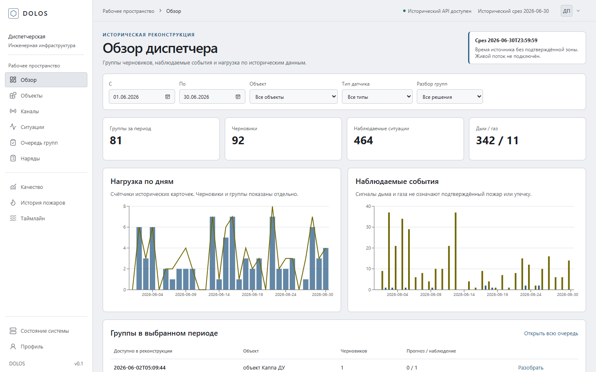
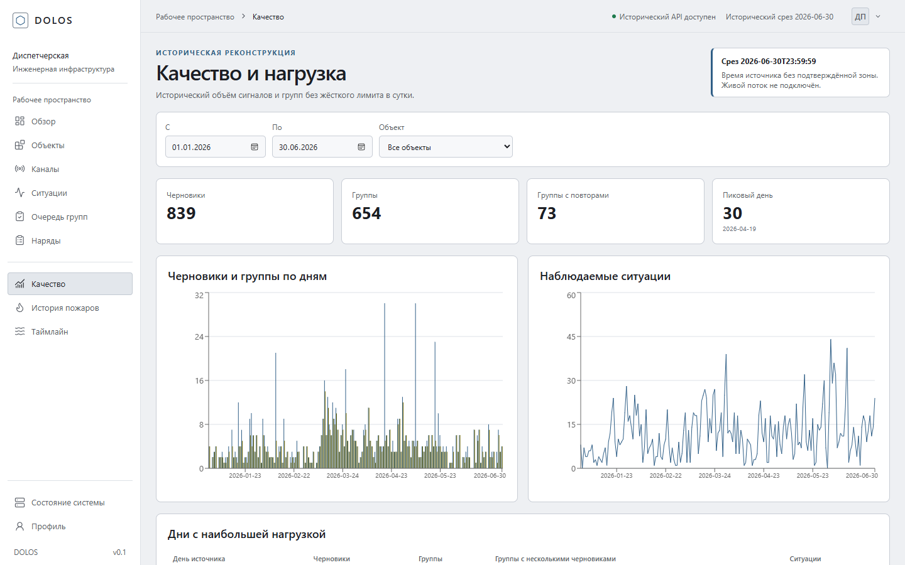

# Dolos – диспетчерский разбор состояния коллекторов

Dolos показывает исторические показания датчиков, объясняет сигналы моделей и помогает диспетчеру разобрать черновики нарядов. Решение о наряде принимает человек. В репозитории объединены интерфейс, API, проверенный пакет ML и исследовательский код.

## Онлайн-прототип для жюри

- [Интерфейс диспетчера](http://45.15.159.227/overview)
- [Описание REST API](http://45.15.159.227/docs)
- [Презентация PDF](docs/submission/Dolos_LCT2026_final.pdf) и [исходный PPTX](docs/submission/Dolos_LCT2026_final.pptx)
- [Короткий маршрут проверки и ограничения](docs/submission/README.md)

Публичный стенд воспроизводит архив до 30 июня 2026 года. Проверка `/api/v2/meta` должна показывать `data_source: ml_handoff_parquet`. Живой поток СМВУ и реальный журнал решений диспетчеров пока не подключены.



## Запуск в Docker на Windows

Самый простой способ поднять весь сервис: интерфейс, API и PostgreSQL запускаются одной командой. Нужны [Docker Desktop](https://www.docker.com/products/docker-desktop/) с включённым WSL 2 и [Git LFS](https://git-lfs.com/).

В PowerShell:

```powershell
git clone https://github.com/MonaCCi111/lct2.git
cd lct2
git lfs pull
docker compose up -d --build
```

Первая сборка занимает 5–10 минут. Затем API загружает пакет ML, обычно меньше минуты. Готовность видна по строке `startup complete` в выводе `docker compose logs -f backend`.

| Адрес | Что открывается |
| --- | --- |
| [http://localhost/overview](http://localhost/overview) | интерфейс диспетчера |
| [http://localhost/docs](http://localhost/docs) | Swagger с описанием REST API |
| [http://localhost/api/v2/meta](http://localhost/api/v2/meta) | версия данных; `data_source` должен быть `ml_handoff_parquet` |

Если порт 80 на компьютере занят (IIS, другой веб-сервер), задайте другой порт и перезапустите:

```powershell
Set-Content .env "HTTP_PORT=8080"
docker compose up -d
```

После этого интерфейс откроется на `http://localhost:8080/overview`. Остановить стенд: `docker compose down`. Сбросить базу вместе с решениями и нарядами: `docker compose down -v`.

Без `git lfs pull` в репозитории остаются только указатели на Parquet, и API переходит на fixtures.

### Как устроен стенд

| Контейнер | Образ | Назначение |
| --- | --- | --- |
| `frontend` | сборка из [`frontend/Dockerfile`](frontend/Dockerfile) | nginx раздаёт собранный интерфейс и передаёт `/api/*`, `/docs`, `/openapi.json` в API ([`nginx.conf`](frontend/nginx.conf)) |
| `backend` | сборка из [`backend/Dockerfile`](backend/Dockerfile) | FastAPI, API v1 и v2, пакет ML из `backend/data/ml_handoff` |
| `db` | `postgres:15-alpine` | решения диспетчера и наряды; данные хранятся в томе `pgdata` |

Все три контейнера описаны в [`docker-compose.yml`](docker-compose.yml). Наружу открыт только порт интерфейса. Интерфейс собирается с относительными адресами `/api/v1` и `/api/v2`, поэтому работает на любом адресе без пересборки. [`.gitattributes`](.gitattributes) сохраняет LF в файлах для контейнеров, даже если на Windows включён `core.autocrlf`.

| Переменная в `.env` | По умолчанию | Назначение |
| --- | --- | --- |
| `HTTP_PORT` | `80` | внешний порт интерфейса |
| `POSTGRES_PASSWORD` | `postgrespassword` | пароль базы; порт БД наружу не открыт |
| `DATABASE_URL` | PostgreSQL в контейнере `db` | можно указать `sqlite+aiosqlite:///./app.db` |

## Развёртывание на сервере

Для проверки по ссылке тот же стенд запускается на Linux-сервере. Команды те же, что и на Windows; установка Docker и Git LFS, обновление и HTTPS описаны в [DEPLOY.md](DEPLOY.md).

```bash
git clone https://github.com/MonaCCi111/lct2.git
cd lct2
git lfs pull
docker compose up -d --build
```

Интерфейс открывается по адресу `http://<адрес-сервера>/overview`, Swagger – `http://<адрес-сервера>/docs`.

| | CPU | RAM | Диск |
| --- | --- | --- | --- |
| Минимум | 1–2 vCPU | 2 ГБ и swap 2 ГБ | 15 ГБ SSD |
| Рекомендуется | 2 vCPU | 4 ГБ | 20 ГБ SSD |
| С запасом под нагрузку | 4 vCPU | 8 ГБ | 30 ГБ SSD |

ОС: Ubuntu 22.04/24.04 или Debian 12 на x86_64. Работающий стенд занимает около 800 МБ памяти, больше всего памяти нужно при сборке образов. Сервер должен открываться из России без VPN, порт 80 должен быть открыт в файрволе.

## Запуск на Windows без Docker

Вариант для разработки: фронт и API запускаются отдельно, с горячей перезагрузкой. Интерфейс в этом режиме обращается к API по адресу `http://localhost:8000`, поэтому открывается только на этом же компьютере.

Нужны Python 3.11+, Node.js 24.15+ с npm и Git LFS. После клонирования выполните `git lfs pull`: пакет исторического инференса хранится в LFS.

Откройте первый PowerShell:

```powershell
cd backend
py -3 -m venv .venv
.\.venv\Scripts\python.exe -m pip install -r requirements.txt
.\.venv\Scripts\python.exe -m uvicorn app.main:app --host 127.0.0.1 --port 8000
```

Во втором PowerShell запустите интерфейс:

```powershell
cd frontend
Copy-Item .env.example .env
(Get-Content .env) -replace 'VITE_ENABLE_MOCKS=true', 'VITE_ENABLE_MOCKS=false' | Set-Content .env
npm.cmd ci
npm.cmd run dev
```

Откройте [http://127.0.0.1:5173/overview](http://127.0.0.1:5173/overview). API и его схема находятся на [http://127.0.0.1:8000/docs](http://127.0.0.1:8000/docs). Первый запуск бэкенда наполняет локальную SQLite и может занять несколько минут. Для проверки данных откройте `/api/v2/meta`: `data_source` должен указывать на пакет ML. Если вместо него загружены fixtures, проверьте `git lfs pull`.

Системный Node.js 24.14 на машине разработки не подходит для части зависимостей. Скрипт `frontend/scripts/npm.ps1` может использовать встроенный Node Codex, но для новой машины установите Node.js 24.15+.

## Маршрут по сервису

1. **Обзор** `/overview` – сводка объектов, каналов, ситуаций и черновиков на выбранный исторический момент.
2. **Очередь** `/review` – группы черновиков; откройте карточку, изучите исходные показания и примите решение. Наряд создаётся отдельно после утверждения.
3. **Каналы и ситуации** `/channels`, `/situations` – пригодность данных, история и объяснения сигналов. Каналы вне справочника остаются видимыми.
4. **Аналитика** `/analytics` – охват, нагрузка очереди, качество моделей и динамика по объектам.
5. **История дымовых сигналов** `/fire-history` – статистика наблюдений. Подтверждённого реестра пожаров в исходных данных нет; этот раздел не считает и не прогнозирует реальные пожары.
6. **Воспроизведение** `/replay` – восемь готовых сценариев с ползунком времени, событиями и связанными карточками. Произвольный исторический интервал требует полного архива ML, который не входит в Git.



## Что показывают модели

Рабочая очередь использует прогнозы по состоянию фазы и насоса, а также наблюдаемые события по другим типам датчиков. Остальные модели и типы имеют явный статус: исследование или отсутствие выпущенного прогноза. `score` служит для сравнения внутри модели; интерфейс не переводит его в вероятность физической аварии, риск или срочность.

Исторический пакет охватывает данные до 30 июня 2026 года: 12 627 каналов, 11 704 ситуации, 2 191 черновик и 1 621 группу. Это демонстрация проверяемого рабочего процесса на архиве. Часовой пояс исходных отметок времени неизвестен, реальные решения диспетчеров и журнал ремонтов не предоставлены. Числовой ИТС поэтому не вычисляется. График плановых работ, когда он появится, нужен для повторной проверки газовых событий и некоторых решений по статусам.

## Структура

| Каталог | Содержимое |
| --- | --- |
| `frontend/` | React, TypeScript, страницы диспетчера, проверки интерфейса, Dockerfile и конфигурация nginx |
| `backend/` | FastAPI, API v1 и v2, локальное хранение решений и нарядов, данные для инференса, Dockerfile |
| `production_ml/` | код подготовки данных, модели и правила выдачи карточек |
| `integration/` | контракты и примеры передачи между ML, бэкендом и фронтом |
| `validation/` | протоколы проверок и метрики |
| `research/` | исследовательские ноутбуки и эксперименты |
| `dataset/` | справочники и небольшой срез исходных данных |

Исходный пакет для API v2 находится в `backend/data/ml_handoff/`. Его Parquet отслеживаются через Git LFS. Полный архив телеметрии, локальные базы, кэши и временные файлы в репозиторий не входят.

## Проверка

```powershell
cd frontend
npm.cmd test
npm.cmd run build
```

```powershell
cd backend
.\.venv\Scripts\python.exe -m pytest tests -q
```

Для сквозной проверки после запуска обеих частей: `cd frontend; npm.cmd run test:browser`. Действующий [контракт API v2](backend/data/ml_handoff/api_contract_v1.json), [состояние ML](validation/FINAL_PRODUCT_V1_STATUS.txt), [руководство бэкенда](backend/README.md) и [руководство фронта](frontend/README.md) находятся в репозитории.
